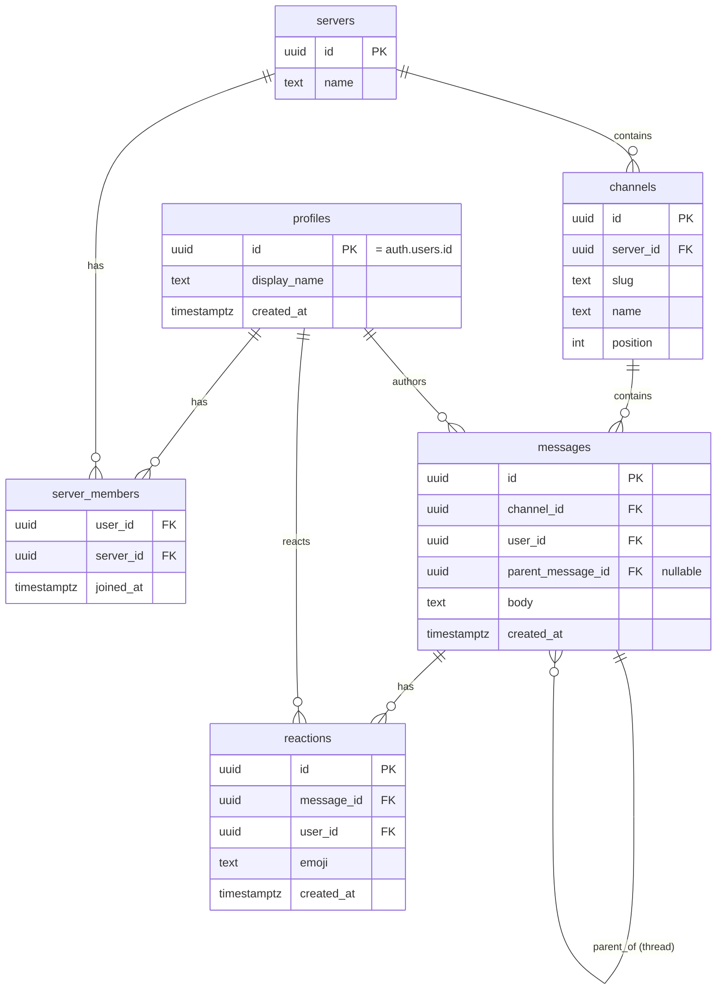
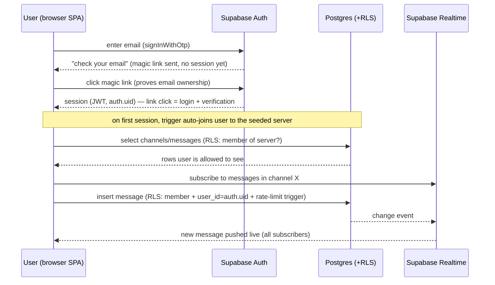

rel - [[Vibe App - 02 Chat clone - Requirements (brainstorm)]] · [[Vibe App - 02 Chat clone (Discord-Slack)]] · [[Setup - vibe30 app pipeline]] · [[Vibe 30 - Journal]]

# Plan — CommunityChat v1 (Discord/Slack clone)

> **Greenfield.** No repo exists yet. This plan covers scaffolding → backend → features → deploy. **When `vibe-communitychat` is scaffolded, copy this file to `docs/plans/2026-06-24-001-feat-communitychat-v1-plan.md`** (repo-relative) so `ce-work`/`lfg` read it in-repo. All file paths below are **repo-relative to `vibe-communitychat/`** unless noted.
> Feeds `lfg` next. Origin requirements: [[Vibe App - 02 Chat clone - Requirements (brainstorm)]].

---

## Summary
Build CommunityChat: a single-server, Slack/Discord-style chat web app. **Vite + React + TS SPA** on Cloudflare Pages, **Supabase** backend (Auth + Postgres + Realtime). v1 = open signup w/ email confirmation, seeded channels, text messages, Slack-style threads, live message updates, and first-class abuse controls (RLS on every table, DB-side rate limiting, monitoring + a documented Supabase-side kill switch). Text-only; uploads/presence/typing are fast-follows.

A prerequisite step (U1) builds a reusable **`vibe-starter-react`** template, mirroring the existing `vibe-starter`, before the app repo is spun from it.

---

## Execution model — where `lfg` comes in
`lfg` runs **inside an existing repo** and is **hands-off** (it can't create its own host repo, and it can't pause for interactive dashboard steps). So:

- **Phase A = bootstrap by hand** (interactive Claude Code session, NOT `lfg`): **U1** (template repo) + **U2** (scaffold `vibe-communitychat`, wire Supabase client) + human **H1** (Supabase project + keys) and **H4** (CF git-connect). Then copy this plan into the repo's `docs/plans/`. This is the work that *can't* be hands-off (repo creation + dashboard OAuth) — and doing it first is what makes `lfg`'s CI-watch loop + per-PR preview deploys actually fire.
- **Before launching `lfg`, finish the dashboard toggles** so the hands-off run doesn't stall: **H2** (magic-link Site URL + redirect URLs → gates U7), and decide **H5** — easiest is to **auth the `supabase` CLI** so Claude can `db push` itself (else it needs you to paste SQL at U3). *(H3/Realtime is no longer manual — it's enabled in the migration SQL.)*
- **Then `lfg`** (run from inside the repo, pointed at this plan) executes **U3–U13 (Phases B–D)**. `ce-work` derives progress from git, sees U1/U2 done, and continues at U3 → `ce-work → ce-simplify → ce-code-review → ce-test-browser → ce-commit-push-pr → watch CI`. **You review the PR + merge** (human gate stays on).

> TL;DR: **all of H1–H5 + Phase A first → then `lfg` for B–D.**

---

## Problem frame
The first Tier-B / keeper vibe app and the first with a real backend — the genuine SDLC test (plan → review → CI all earn their keep) and the first app exposing storage/processing to *external* users. Two things must be true: (1) the realtime chat UX works (post a message, a second user sees it live, reply in a thread); (2) abuse is contained by construction (RLS is the real data boundary; rate limits + monitoring + a kill switch are the safety net), because open signup invites misuse.

---

## Requirements traceability
| Req (origin) | Covered by |
|---|---|
| Auth — magic link (passwordless); link-click = verification; optional pw = fast-follow | U7, KTD-4 |
| Emoji reactions (live counts, own add/remove) | U14 |
| Single server, multi-server-ready (`server_id` everywhere) | U3 (schema), KTD-1 |
| Channels (seeded fixed set) | U3, U6 |
| Welcome experience (instructions + intro nudge + repo link) | U12 |
| Messaging (text only) | U9 |
| Threads (Slack-style, off a parent message) | U11, KTD-2 |
| Realtime (live messages; presence/typing deferred) | U10 |
| RLS on every table | U4 |
| Rate limiting (message send; signup) | U5, KTD-3 |
| Usage monitoring + circuit-breaker | U13 |
| Hard kill switch (Supabase-side) | U13, KTD-5 |
| Deployed at vibe-communitychat.pages.dev | Human setup §H4 + git-connect |

---

## Key technical decisions
- **KTD-1 — Single server, multi-server-ready schema.** Every domain table carries `server_id` (FK to `servers`). v1 seeds exactly one server row and has no server-create UI; adding servers later is additive (new rows + a switcher), not a migration. Membership is modelled as `server_members(user_id, server_id)` so channel/message visibility is "is the user a member of this row's server".
- **KTD-2 — Threads via self-referential `parent_message_id`.** `messages.parent_message_id` (nullable FK → `messages.id`). A top-level message has `NULL`; a reply points at its parent. A thread = parent + all rows whose `parent_message_id` = parent. No separate threads table. (Rationale: simplest model that satisfies Slack-style threading; avoids a join table v1 doesn't need.)
- **KTD-3 — Rate limiting in the database, no Edge Function in v1.** A `BEFORE INSERT` trigger on `messages` counts the author's recent rows (e.g. > 5 in 10s OR > 30 in 60s) and `RAISE`s to reject floods. Enforced in Postgres → cannot be bypassed by a malicious client holding the anon key. Signup throttling leans on Supabase Auth's built-in protections + email confirmation. **Consequence: v1 is pure client + RLS + triggers** — no server-side functions to deploy. (An Edge Function is the fast-follow path if limits need to get smarter.)
- **KTD-4 — Magic-link (passwordless) auth; the link click is both login and email verification.** v1 uses Supabase Auth magic links (`signInWithOtp`): enter email → click the emailed link → session. The click proves email ownership, so there is **no separate confirm-email step** (lower friction, less code) while keeping the same abuse gate (unique deliverable email + click). **No password in v1.** *Optional password is a fast-follow* — Supabase `updateUser({password})` can add one to an existing passwordless account, so magic-link-first means zero rework later (offered post-first-login + in account settings).
- **KTD-5 — The kill switch is Supabase-side.** Because the anon key ships in the browser bundle (public by design), taking down CF Pages does NOT stop backend access. The true off-switch is **pausing the Supabase project**; surgical options are deny-all RLS / disable signups. Documented as `KILL-SWITCH.md` (U13).
- **KTD-6 — Key handling.** `VITE_SUPABASE_URL` + **anon key** are public, injected at build via env vars (fine — RLS protects data). The **service-role key is never** referenced in client code or committed; not needed in v1 (no Edge Function).
- **KTD-7 — No message edit/delete in v1.** Insert + read only. Keeps RLS surface minimal; edit/delete + moderation (ban) are fast-follows.

---

## High-Level Technical Design

### Data model (ERD)


### Realtime + auth flow


---

## Output Structure (new repo: `vibe-communitychat`)
```
vibe-communitychat/
├── .github/workflows/ci.yml        # inherited from vibe-starter-react
├── supabase/
│   ├── migrations/
│   │   ├── 0001_schema.sql          # U3
│   │   ├── 0002_rls.sql             # U4
│   │   ├── 0003_rate_limit.sql      # U5
│   │   ├── 0004_seed.sql            # U6
│   │   └── 0005_reactions.sql       # U14 (reactions table + RLS)
│   └── config.toml
├── src/
│   ├── lib/supabaseClient.ts        # U2
│   ├── auth/                        # U7  (AuthProvider, MagicLinkForm, AuthCallback)
│   ├── hooks/                       # useChannels, useMessages, useRealtimeMessages, useReactions
│   ├── components/                  # AppShell, ChannelSidebar, MessageList, MessageComposer, ThreadPanel, WelcomeBanner, ReactionBar
│   ├── App.tsx
│   └── main.tsx
├── .env.example                     # VITE_SUPABASE_URL=, VITE_SUPABASE_ANON_KEY=
├── KILL-SWITCH.md                   # U13
├── CLAUDE.md                        # house rules (inherited + app-specific)
├── README.md
└── package.json
```

---

## Human setup (interactive — Ajith, NOT Claude)
These are the dashboard/OAuth steps Claude can't do. Each is **pinned to the unit it gates** and interleaves with the build — they are NOT a batch to run at the end. (Mirrors the automation map in [[Setup - vibe30 app pipeline]].)

> **Note on git-connect (H4):** the **template repo (U1) does NOT get git-connected** — templates are never deployed. Git-connect applies only to the **app repo (`vibe-communitychat`)**, and per the "git-connect from creation" decision it happens **right after U2 creates the repo**, not as a final deploy step.

**Ordered sequence (human steps ⟂ Claude units):**
1. **U1** — Claude builds `vibe-starter-react` template. *(No human step; no Supabase, no CF connect.)*
2. **H1 — Create the Supabase project ✅ DONE (Jun 24, project `axotgmkyfffazntrbjio`).** (dashboard). **Region:** East US (N. Virginia) default, or Canada (Central) if data residency matters — not the "Americas" group header. **Security toggles (decided Jun 24):** Enable Data API **ON** · Automatically expose new tables **ON** · Enable automatic RLS **ON**. *Why "expose new tables = ON" and not Supabase's stricter default: RLS is the data boundary here (U4 enables RLS + restrictive policies on every table), and the migrations ship **no table-level `GRANT`s** — so leaving auto-expose OFF would deny the `authenticated` role at the GRANT layer (before RLS even evaluates) and the hands-off `lfg` run would read back empty. ON = grants exist, RLS still enforces access; exposed ≠ open. (If we ever switch auto-expose OFF, add `GRANT SELECT/INSERT … TO authenticated` to `0002_rls.sql` + `0005_reactions.sql` first.)* Copy **Project URL** + **anon key** → hand to Claude. *(Gates U2's env wiring + U3 schema. Do before/with U2.)*
3. **U2** — Claude scaffolds `vibe-communitychat` from the template + wires the Supabase client.
4. **H4 — Cloudflare Pages git-connect ✅ DONE (Jun 24)** for `vibe-communitychat` (Pages tab, not Workers — pipeline §Part 2 gotcha): build `npm run build`, output `dist`, env vars `VITE_SUPABASE_URL` + `VITE_SUPABASE_ANON_KEY` + `NODE_VERSION=24` (Production + Preview). **Framework preset can be left empty** — Vite isn't always offered; only the build command + output dir matter (verified: live build serves `/assets/*.js`, not raw source). Live + built at **https://vibe-communitychat.pages.dev**.
5. **H2 — Auth settings (magic link) ✅ DONE (Jun 24).** Email provider ON; Site URL = `https://vibe-communitychat.pages.dev/` + Redirect URLs for that and `http://localhost:5173/` (verified via screenshots). **No separate "magic link" toggle exists** — magic link IS the email provider (`signInWithOtp` sends it). Just verify **"Allow new users to sign up" is ON** (Sign In / Providers). (No confirm-email toggle — the link click is the verification per KTD-4.)
6. **H3 — Realtime: handled in SQL, NOT a manual step (decided Jun 24).** Instead of a dashboard toggle, the migrations add the tables to the Realtime publication (`alter publication supabase_realtime add table messages;` in U10's migration, `… add table reactions;` in U14's). Keeps the `lfg` run hands-off — nothing to click. *(No human action.)*
7. **H5 — Migration apply path (CLI) ✅ DONE (Jun 24).** `npx supabase login` done (token in keyring; `projects list` confirms auth). `SUPABASE_DB_PASSWORD` set via `setx` (persisted in `HKCU:\Environment`, len 16). **Windows quirk:** `setx` doesn't reach already-running sessions, so Claude's tool shells inherit a stale env and don't see it as a process var — Claude reads it from the registry inline instead: `$env:SUPABASE_DB_PASSWORD = (Get-ItemProperty 'HKCU:\Environment').SUPABASE_DB_PASSWORD` before `npx supabase link --project-ref axotgmkyfffazntrbjio` + `db push`. **Implication for `lfg`:** Claude applies the migrations itself at U3 (lfg's internal shells share the same stale env), then lets the pipeline continue. *(Applies U3–U6 + realtime/reactions migrations.)*

---

## Implementation units

### Phase A — Scaffold

### U1. Build `vibe-starter-react` template repo ✅ DONE (Jun 24 — github.com/ajthilakan/vibe-starter-react)
- **Goal:** A reusable Vite + React + TS template (sibling to `vibe-starter`), so this and future React apps start one click in.
- **Dependencies:** none.
- **Files (in a separate `vibe-starter-react` repo):** `package.json`, `.gitignore`, `.github/workflows/ci.yml`, `README.md`, `CLAUDE.md`, `tsconfig.json`, `index.html`, `src/main.tsx`, `src/App.tsx`.
- **Approach:** `npm create vite@latest -- --template react-ts`. Port `vibe-starter`'s `ci.yml` (npm ci → build → test --if-present + gitleaks), `.gitignore` (+ `.env`, `.env.*`), committed `package-lock.json`, and `CLAUDE.md` house rules (public repo/no secrets, push-don't-merge, build-before-deploy). Mark the GitHub repo as a template.
- **Patterns to follow:** existing `vibe-starter` repo structure (per pipeline §1.1).
- **Test scenarios:** `Test expectation: none -- scaffolding/template`. Verification: `npm ci && npm run build` green; repo flagged as template.
- **Verification:** template repo exists, public, marked template, CI green on initial push.

### U2. Scaffold `vibe-communitychat` from the template + wire Supabase client ✅ DONE (Jun 24 — github.com/ajthilakan/vibe-communitychat, live at vibe-communitychat.pages.dev)
- **Goal:** The app repo exists, builds, and can talk to Supabase.
- **Dependencies:** U1.
- **Files:** repo from template; add `src/lib/supabaseClient.ts`, `.env.example`, dep `@supabase/supabase-js`.
- **Approach:** `gh repo create vibe-communitychat --template <you>/vibe-starter-react --public --clone`. Add supabase-js. `supabaseClient.ts` reads `import.meta.env.VITE_SUPABASE_URL` + `VITE_SUPABASE_ANON_KEY`. `.env.example` documents both (no real values committed). **→ As soon as this repo exists, do Human step H4 (CF Pages git-connect + env vars) — "git-connect from creation."** The template repo (U1) is never connected.
- **Test scenarios:** happy path — client module imports without throwing when env vars are set; missing env var surfaces a clear console error. `Covers` nothing yet (no behavior).
- **Verification:** `npm run build` green; app boots locally against a real Supabase URL/anon key.

### Phase B — Backend (schema, security, seed)

### U3. Database schema + migrations
- **Goal:** Postgres tables for the data model (KTD-1, KTD-2).
- **Dependencies:** U2; Human H1 (project exists).
- **Files:** `supabase/migrations/0001_schema.sql`, `supabase/config.toml`.
- **Approach:** create `profiles`, `servers`, `server_members`, `channels`, `messages` per the ERD. FKs + indexes on `messages(channel_id, created_at)` and `messages(parent_message_id)`. A trigger on `auth.users` insert creates a `profiles` row and auto-joins the seeded server (`server_members`). Decide apply path with Ajith (CLI `supabase db push` vs SQL editor — H5).
- **Test scenarios:** schema applies cleanly on a fresh DB; inserting a user creates a profile + membership (trigger). Edge: duplicate membership is prevented (PK/unique on `(user_id, server_id)`).
- **Verification:** migration applies; tables + trigger present; a new auth user is auto-joined.

### U4. RLS policies on every table
- **Goal:** RLS is the real data boundary (origin abuse §1). No client reads/writes outside its server membership.
- **Dependencies:** U3.
- **Files:** `supabase/migrations/0002_rls.sql`.
- **Approach:** `ENABLE ROW LEVEL SECURITY` on all tables. Policies: **profiles** — select for any authenticated member (to render author names), insert/update own (`id = auth.uid()`). **servers/channels** — select if `auth.uid()` ∈ `server_members` for that `server_id`; no client insert (seeded). **server_members** — select rows for servers you belong to; insert only your own membership. **messages** — select if member of the channel's server; insert only when `user_id = auth.uid()` AND member of the server; no update/delete (KTD-7).
- **Test scenarios:** **Covers RLS success criterion.** (1) Member reads channel messages → allowed. (2) Non-member attempts select on another server's messages → 0 rows / denied. (3) User inserts message with `user_id` ≠ their uid → denied. (4) Non-member insert into a channel → denied. (5) Unauthenticated select → denied. Error path: forged `user_id` rejected.
- **Verification:** the 5 scenarios pass against a real project using two test users (one member, one not).

### U5. DB-side rate limiting
- **Goal:** Reject message floods server-side (KTD-3), unbypassable from the client.
- **Dependencies:** U3, U4.
- **Files:** `supabase/migrations/0003_rate_limit.sql`.
- **Approach:** `BEFORE INSERT` trigger function on `messages`: count rows by `auth.uid()` within a recent window; `RAISE EXCEPTION` if over threshold (start: >5 / 10s and >30 / 60s — tune in review). Returns a clear error the UI can surface.
- **Test scenarios:** **Covers rate-limit success criterion.** Happy path — normal cadence inserts succeed. Limit — rapid 6th insert within 10s is rejected with the rate-limit error. Recovery — after the window, inserts succeed again. Edge — two different users are limited independently.
- **Verification:** scripted burst is throttled; normal use unaffected.

### U6. Seed the server + channels
- **Goal:** One server + the fixed channel set exist on first deploy.
- **Dependencies:** U3.
- **Files:** `supabase/migrations/0004_seed.sql`.
- **Approach:** insert one `servers` row; insert channels `#welcome`, `#world-cup-2026`, `#tv-shows`, `#books`, `#games` with `position` ordering. Idempotent (guard on slug).
- **Test scenarios:** seed applies once; re-running doesn't duplicate channels. `Test expectation` includes idempotency.
- **Verification:** 5 channels present, ordered, attached to the one server.

### Phase C — App features

### U7. Auth flows (magic link, passwordless / session)
- **Goal:** Users sign in/up with a magic link; the link click both logs them in and verifies the email; session persists; protected UI gates on session (KTD-4).
- **Dependencies:** U2; Human H2.
- **Files:** `src/auth/AuthProvider.tsx`, `src/auth/MagicLinkForm.tsx`, `src/auth/AuthCallback.tsx`, test `src/auth/AuthProvider.test.tsx`.
- **Approach:** `AuthProvider` wraps the app, exposes `session`/`user` via `supabase.auth`. `MagicLinkForm` = one email field → `signInWithOtp({ email })` → "check your email" notice. `AuthCallback` handles the redirect back from the link (Supabase parses the session from the URL), then routes into the app. Auth-state listener keeps the session fresh across reloads. Unauthenticated users see only the magic-link screen. **No password field, no separate confirm step.** *(Optional-password is a fast-follow, not built here — see KTD-4.)*
- **Test scenarios:** happy — submitting an email triggers `signInWithOtp` and shows the "check your email" notice; completing the link callback yields a session and lands in the app; reload preserves session. Edge — malformed/empty email blocked client-side; an expired/invalid link surfaces a clear "request a new link" message. Integration — auth-state change re-renders the app shell; sign-out clears the session.
- **Verification:** full enter-email → click-link → in → reload loop works against the real project; a returning user gets back in with a fresh link.

### U8. App shell + channel sidebar
- **Goal:** Authenticated layout: server name, channel list sidebar, main pane, sign-out.
- **Dependencies:** U7, U3/U6 (channels exist), U4.
- **Files:** `src/components/AppShell.tsx`, `src/components/ChannelSidebar.tsx`, `src/hooks/useChannels.ts`, tests alongside.
- **Approach:** `useChannels` selects channels for the server (RLS-scoped). Sidebar lists them ordered by `position`; selecting one sets the active channel (URL or state). `#welcome` is the default selection on first login.
- **Test scenarios:** happy — sidebar renders seeded channels in order; clicking selects. Edge — empty/loading state while fetching. Integration — only channels the user can see (RLS) appear.
- **Verification:** logged-in user sees the 5 channels and can switch.

### U9. Message list + composer (post text)
- **Goal:** Read a channel's messages; post a text message.
- **Dependencies:** U8, U4, U5.
- **Files:** `src/components/MessageList.tsx`, `src/components/MessageComposer.tsx`, `src/hooks/useMessages.ts`, tests alongside.
- **Approach:** `useMessages(channelId)` loads top-level messages (`parent_message_id IS NULL`) ordered by `created_at`, with author display_name (join/embed on profiles). Composer inserts a message (`user_id = auth.uid`, `channel_id`). Surface the rate-limit error from U5 inline. Empty body rejected client-side.
- **Test scenarios:** happy — type + send appends the message with author + timestamp. Edge — empty/whitespace body blocked; very long body handled. Error — rate-limit rejection shows a friendly message; insert failure surfaced. Integration — message persists and reloads.
- **Verification:** post a message, reload, it's still there with correct author.

### U10. Realtime live messages
- **Goal:** New messages/replies appear live without refresh (origin realtime req).
- **Dependencies:** U9.
- **Files:** `supabase/migrations/0006_realtime.sql` (or fold into U3), `src/hooks/useRealtimeMessages.ts`, wire into `MessageList`.
- **Approach:** **Enable Realtime in SQL** (`alter publication supabase_realtime add table messages;`) — no dashboard step (former H3). Then subscribe to Postgres changes (INSERT) on `messages` filtered by `channel_id`; append to local state; unsubscribe on channel change/unmount. De-dupe against the optimistic/initial load.
- **Test scenarios:** **Covers "second user sees messages live".** Happy — a message inserted by another client appears without refresh. Edge — switching channels resubscribes to the new channel only; no leak/duplicate. Integration — subscription tears down on unmount (no memory leak).
- **Verification:** two browser sessions; A posts, B sees it live.

### U11. Threads (Slack-style replies)
- **Goal:** Reply to a message in a thread; view parent + replies (KTD-2).
- **Dependencies:** U9, U10.
- **Files:** `src/components/ThreadPanel.tsx`, extend `useMessages`/composer for `parent_message_id`, tests alongside.
- **Approach:** clicking a message opens a thread panel loading replies (`parent_message_id = message.id`); composer there sets `parent_message_id`. Main list shows a reply count/indicator on parents. Realtime subscription covers replies too (same table).
- **Test scenarios:** happy — open a thread, post a reply, it appears under the parent. Edge — parent with no replies shows empty thread; reply indicator updates. Integration — a reply arrives live in the open thread panel.
- **Verification:** post a reply; it shows in-thread and live for a second user.

### U12. Welcome experience
- **Goal:** New users land on `#welcome` with clear instructions + intro nudge + GitHub repo link.
- **Dependencies:** U8.
- **Files:** `src/components/WelcomeBanner.tsx`, wired into the `#welcome` channel view.
- **Approach:** static (hardcoded) banner rendered at the top of `#welcome`: what you can do here, "introduce yourself", "find a channel of interest", and a link to the GitHub repo. `#welcome` remains a normal writable channel (intros go there). No DB seeding of messages, no special RLS (KTD — simplest that delivers the content).
- **Test scenarios:** happy — banner renders on `#welcome` with the repo link; default channel on first login is `#welcome`. Edge — banner only on `#welcome`, not other channels. `Covers welcome success criterion.`
- **Verification:** first login lands on `#welcome` showing instructions + working repo link.

### U14. Emoji reactions
- **Goal:** React to a message with an emoji; counts update live; a user toggles their own reaction (origin req #8). Self-contained: ships its own migration + RLS + UI.
- **Dependencies:** U9 (messages), U10 (realtime), U4 (RLS pattern).
- **Files:** `supabase/migrations/0005_reactions.sql`, `src/hooks/useReactions.ts`, `src/components/ReactionBar.tsx`, wired into `MessageList`/`ThreadPanel`; tests alongside.
- **Approach:** `reactions(id, message_id, user_id, emoji, created_at)` with a **unique constraint on `(message_id, user_id, emoji)`** (one of each emoji per user → click toggles insert/delete). RLS: select if member of the message's server; insert/delete only your own (`user_id = auth.uid()`). Enable Realtime in SQL (`alter publication supabase_realtime add table reactions;`) — no dashboard step. `ReactionBar` shows aggregated counts + a small picker; clicking toggles. `useReactions` subscribes for live count updates. Keep the emoji set small/curated for v1.
- **Test scenarios:** happy — click an emoji adds your reaction and bumps the count; clicking again removes it. Edge — reacting twice with the same emoji is a no-op (unique constraint); multiple users' reactions aggregate correctly. Error — non-member insert denied (RLS); deleting another user's reaction denied. Integration — a reaction added by a second client updates the count **live**. `Covers the "reaction counts update live" success criterion.`
- **Verification:** two sessions; A reacts, B sees the count change live; A toggles off and it decrements.

### Phase D — Safety & ops

### U13. Kill-switch runbook + usage monitoring
- **Goal:** A documented operator path to kill abuse + visibility on usage (origin abuse §6, §4; KTD-5).
- **Dependencies:** U3 (something to protect).
- **Files:** `KILL-SWITCH.md`, a `## Operations` section in `README.md`.
- **Approach:** `KILL-SWITCH.md` = tiered, fastest-first: (1) **pause the Supabase project** (true off; note the anon-key-is-public reason CF-only ≠ kill), (2) deny-all RLS / disable signups (surgical), (3) unpublish CF Pages (with #1). Monitoring: how to watch Supabase usage (MAU, DB rows, egress) + free-tier ceilings as the circuit-breaker; where to look, what thresholds signal abuse.
- **Test scenarios:** `Test expectation: none -- docs/runbook`. Verification = a reviewer can follow the steps and the steps are correct for the current Supabase dashboard.
- **Verification:** runbook steps are accurate; monitoring location documented.

---

## Scope boundaries
**In v1:** auth (open, magic-link/passwordless), single seeded server, 5 seeded channels, text messages, threads, live messages, **emoji reactions**, RLS, DB rate limiting, kill-switch + monitoring docs, welcome banner.

### Deferred to Follow-Up Work
- **Optional password** — set after first magic-link login + in account settings (no rework; KTD-4).
- File/image uploads + Supabase Storage (+ storage-cap controls).
- Presence + typing indicators.
- Reaction-spam rate limiting (lower abuse value than message floods).
- Multiple servers / server-create UI (schema is ready).
- Moderation: ban users; message edit/delete.
- Invite-only mode (email request → approve).
- Edge Function for smarter rate limiting if DB triggers prove insufficient.

### Outside v1 / later post-MVP
DMs, roles/permissions, search, notifications, mobile, voice/video. **Audio messages + auto-transcription** (captured idea).

---

## Risks & mitigations
- **RLS gap = data leak (highest risk).** Mitigation: U4 ships with the 5 adversarial test scenarios using a member + non-member user; treat as a gate. `ce-code-review`'s security persona should scrutinize this.
- **Realtime not enabled / row volume on free tier.** Mitigation: H3 explicit; verify in U10; free tier is fine for v1 scale.
- **Rate-limit thresholds wrong** (too strict frustrates, too loose lets spam through). Mitigation: start conservative, tune in review; thresholds in one SQL file.
- **Anon key misunderstanding** → false sense that CF-down = safe. Mitigation: KTD-5 + KILL-SWITCH.md make the Supabase-side kill explicit.
- **Secrets:** service-role key must never enter client/repo (KTD-6); gitleaks CI (from template) + GitHub push protection back this.

---

## Open questions (deferred to execution, non-blocking)
- Migration apply path: `supabase` CLI (`db push`) vs SQL editor paste — decide at U3 with Ajith (depends on whether he wants the CLI authed).
- Exact rate-limit thresholds — set in U5, tune during review.
- Whether `profiles.display_name` is collected at signup or defaulted from email — minor; resolve in U7.

---

## Status
- **Jun 24 (rev2)** — Recorded **H1 Supabase dashboard picks** (Data API ON · auto-expose tables ON · auto-RLS ON · region East US/N. Virginia). Chose **Option A** (auto-expose ON) over Supabase's stricter default because migrations ship RLS policies but no table `GRANT`s — OFF would break the hands-off `lfg` run. Caveat + the OFF-path fix captured at H1.
- **Jun 24 (rev)** — Auth changed to **magic-link / passwordless** (link-click = verification, drops confirm-email step; optional password = fast-follow, KTD-4/U7/H2 updated). **Added emoji reactions to v1** (new U14 + `reactions` table in ERD/output tree). Scope + success criteria updated.
- **Jun 24** — Plan written (this doc). Resolved origin's 4 outstanding questions (thread model, rate-limit mechanism, no Edge Function v1, welcome location). **Next: review, then `lfg`** pointed at this plan. First executable step = U1 (`vibe-starter-react`).
